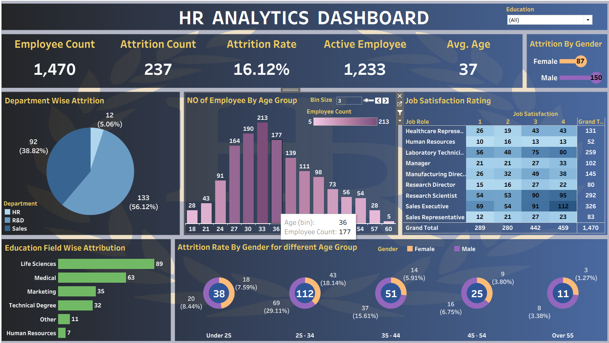

# 📊 HR Analytics Dashboard – Tableau

---

# 📌 Project Overview

This project presents an interactive **HR Analytics Dashboard** built using **Tableau**.

The dashboard helps HR professionals analyze employee data, monitor workforce trends, understand employee attrition, evaluate job satisfaction, and make data-driven HR decisions through interactive visualizations.

---

# 🎯 Objectives

- Monitor employee attrition across departments
- Analyze workforce demographics
- Evaluate job satisfaction by job role
- Understand employee age distribution
- Analyze education-wise attrition
- Compare gender-wise employee attrition
- Support HR decision-making with interactive dashboards

---

# 📈 Key KPIs

- 👥 **Employee Count:** 1,470
- 📉 **Attrition Count:** 237
- 📊 **Attrition Rate:** 16.12%
- ✅ **Active Employees:** 1,233
- 🎂 **Average Age:** 37 Years

---

# 📂 Dashboard Features

## 🎛️ Filters

- Education Filter

---

## 📊 Visualizations

### Employee Overview

- Employee Count
- Active Employee Count
- Attrition Count
- Attrition Rate
- Average Employee Age

### Department-wise Attrition

- HR
- Research & Development
- Sales

### Employee Distribution by Age Group

- Histogram showing employee count by age
- Interactive bin size adjustment

### Job Satisfaction Analysis

- Job satisfaction ratings (1–4)
- Department and job role comparison

### Gender-wise Attrition

- Male vs Female employee attrition

### Education Field-wise Attrition

- Life Sciences
- Medical
- Marketing
- Technical Degree
- Human Resources
- Others

### Attrition by Gender Across Age Groups

- Under 25
- 25–34
- 35–44
- 45–54
- Over 55

---

# 💡 Insights Provided

- Sales department has the highest employee attrition.
- Employees aged **25–34** show the highest attrition.
- Male employee attrition is higher than female attrition.
- Life Sciences has the highest attrition among education fields.
- Job satisfaction varies significantly across different job roles.
- The dashboard enables quick identification of workforce trends.

---

# 🛠️ Tools & Technologies

- Tableau Desktop
- Microsoft Excel / CSV
- Data Visualization
- Dashboard Design

---

# 📁 Repository Structure

```
HR-Analytics-Dashboard-Tableau/
│
├── Dashboard/
│   ├── HR Analytics Dashboard.twb
│   └── HR Analytics Dashboard.twbx
│
├── Dataset/
│   └── HR_Analytics.csv
│
├── Images/
│   └── dashboard.png
│
├── README.md
└── LICENSE
```

---

# 🚀 How to Use

1. Clone or download this repository.

2. Open

```
HR Analytics Dashboard.twb
```

or

```
HR Analytics Dashboard.twbx
```

using **Tableau Desktop**.

3. If prompted, reconnect the dataset.

4. Explore the dashboard using the **Education** filter and interactive charts.

---

# 📸 Dashboard Preview



---

# 📊 Dashboard Highlights

✔ Employee Overview

✔ Department-wise Attrition

✔ Employee Age Distribution

✔ Job Satisfaction Analysis

✔ Gender-wise Attrition

✔ Education-wise Attrition

✔ Interactive Filters

✔ HR KPI Cards

---

# 🔮 Future Enhancements

- Employee Attrition Prediction using Machine Learning
- Live Database Integration (SQL Server/MySQL)
- Tableau Public Dashboard
- Employee Performance Dashboard
- Recruitment Analytics Dashboard

---

# 👨‍💻 Author

**Pranav Patil**

📧 Email: pranavpatil2092@gmail.com

🔗 LinkedIn: https://www.linkedin.com/in/pranav-patil-108424300

💻 GitHub: https://github.com/pranavpatil2092

